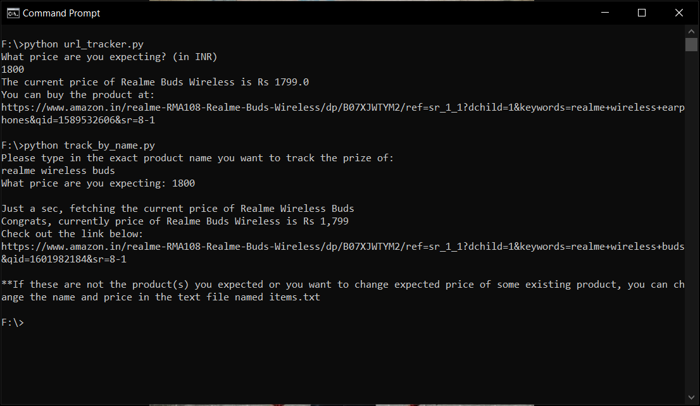

## Amazon Price Tracker
### What these scripts does?
1) **Track price by URL** - Track price of any product by replacing the url of that amazon product in the python script. 
2) **Track price by product name** - Track prices of multiple products by just telling the product name, and expected price (accurate if you give the product name exact, you'll be getting the product link to buy if the price feel down)

Technologies used: ***Web Scraping(requests, BeautifulSoup)***

### How to use these scripts?
- Run the below command to make sure libraries used in this script are installed: 
`pip install -r requirements.txt`

- Run the following command: 
`python url_tracker.py` (*for tracking using url of the product*) 
`python track_by_name.py` (*for tracking using name of the product*)

### Scripts in action

